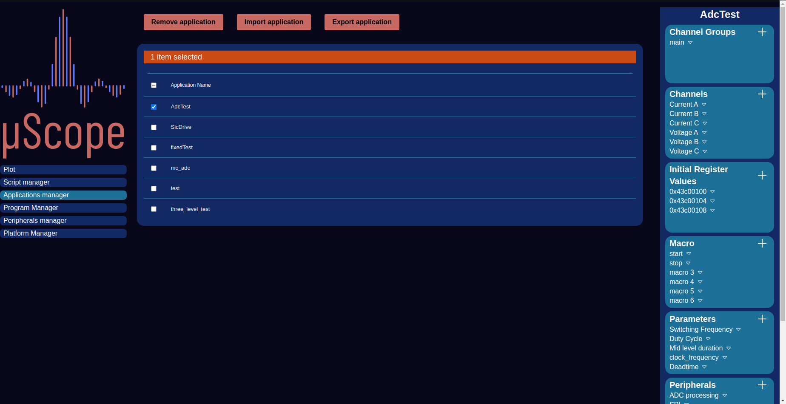

.. _applications:

================
Applications
================

    Applications Manager

The extreme flexibility of FPGA devices in general, and of the µScope platform logic in particular, makes the design of a single unified
HMI solution that fits all use cases a very hard task. This coupled with the extreme variability of research goals, methodologies and fields
means that the problem is not only difficult to solve, but also ill defined, making convential UI solutions non viable.
To tackle this problem the Client is built around the concept of Application. An Application is a specification that ties together all the data
needed in order to define and take full advantage of the capabilities of the Logic and the target hardware.
The following components can be included in an application:

- **Peripherals**: An application will contain informations for one or more instances of a peripheral, defining base address and evenual parameters.
- **Parameters**: In order to control the target hardware parameters may be defined, each one of them will have an associated input field in the parameters are. Upon submission, the modified parameter values will trigger a script to run
- **Macros**: A macro provides a way to trigger the run of a script not directly linked with a single parameter
- **Channels**: Data channels linked with the embedded oscilloscope
- **Inital Register Values**: Pairs of address and values to be written upon initialization of the application.

Centerpiece of the Applications infrastructure is the manager, which allows their creation, modification, and removal. In order to facilitate sharing
between differing setups applications can be imported and exported in a textual format.

.. figure:: ../assets/app_creator.png
    :scale: 25 %

    Applications Creator
