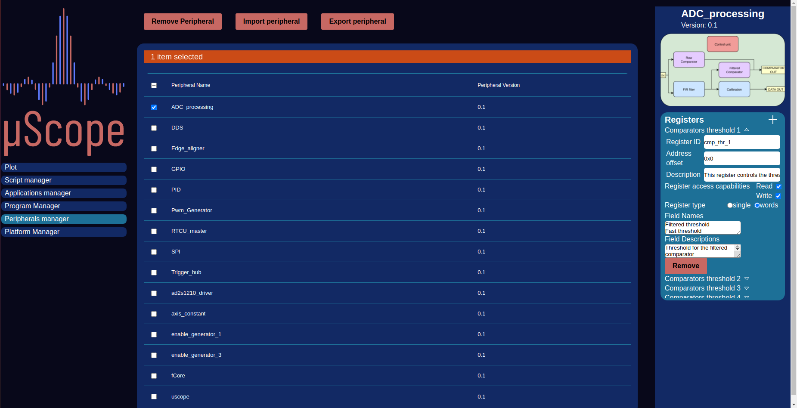

.. _peripherals:

================
Peripherals
================

    Peripherals Manager

The decoupling of Logic HDL and upstream software development requires the definition of a set of a fixed interface to build upon. The Peripheral
fill exactly this role. Their main function is to define the register maps for the logic IP to which it refers, defining names, types and offsets of
all the registers reachable for the bus. As for the Applications, Manager and creator views are provvided to allow easy peripheral definitions.

An Peripheral diagram is also required, this image is usefull to give an idea at a glance of how the internal structure of the IP is constructed.

------------------
 Register fields
------------------

- **ID**: String used to identify the register in scripts
- **Address offset**: offset of this register address from the peripheral base
- **Description**: description of the register function
- **Register Access capabilities**: Boolean options specifying whether the register can be read from or written to
- **register type**: type of register either single (one 32 bit word) or words ( two 16 bit words)
- **field names**: Name of each field in a words type register (insert two rows in the text area with one name per row)
- **field descriptions**: Description of each field in a words type register (insert two rows in the text area with one description per row)