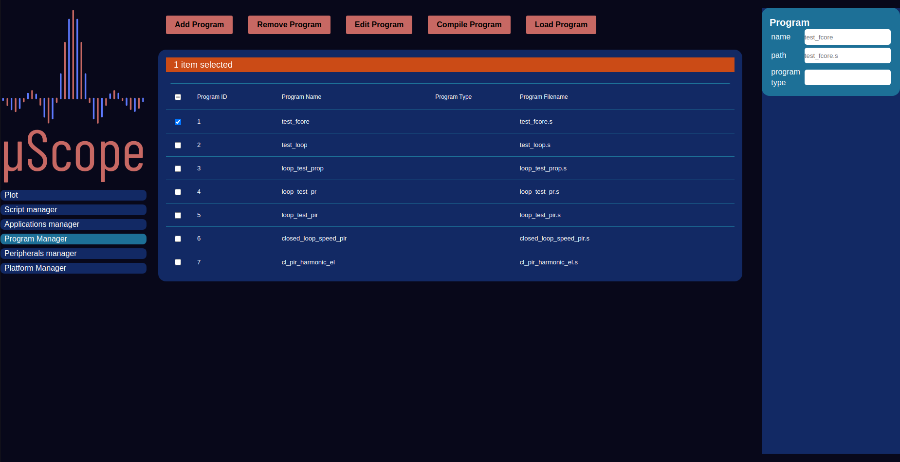

========================
femtoCore
========================

----------
Rationale
----------

The implementation of control systems can usually be reduced to the solution of one or more equations, 
and provided that all required data is made available by the rest of the system, the processing core's
only responsibility is to perform a series of arithmetic and logic operations in order to obtain
the required control action.
To take advantage of this characteristic of the application, A custom instruction set (ISA) 
and processor core has been specifically designed in order to allow the implementation of the control
system calculations as software, while retaining a fully deterministic execution.

----------
ISA
----------

To achieve the goal of completely deterministic execution, the Instruction Set Architecture (ISA) design plays as much of a role
as the processor architecture and implementation themselves. Careful choice of the allowed operations can ensure bounded
execution time, while not impeding software development for the targeted application. The lack of ISA level support for branch
and procedure call operation ensures a linear and predictable execution flow. The unified memory structure also eliminates the need 
for most data handling operations, as the whole memory pool can be directly accessed by the execution units, leaving the load constant
as the only operation in this class.

From a physical perspective all instructions have a very similar structure with a 5 bit opcode followed by a series of optional
6 bit arguments representing the addresses of operands and destination. Four different structures, shown in Fig.~\ref{fig:instruction_structures}, are used.

- **Independent instructions**: This structure is used for a varied class of instructions mainly needed to control the execution flow of the program. The instructions are composed by the opcode only, with the remaining bits zeroed out for future expansion. 
- **Load Constant**: This structure, used for the load constant instruction only, here the opcode is followed by a destination address, with all other bits zeroed. The constant to load needs to be placed as a complete 32 bit word after this instruction, interleaving it with the instruction stream.
- **Unary instructions**:This structure is used for instruction that act on a single operand and is used for conversion between float and integer number formats. For these the opcode is followed by operand and result destination addresses.  
- **Binary instructions**: This structure is used for arithmetic, logic and comparison instructions that act on two operands and return a result. Here the opcode is followed by the two operand and destination addresses. 

+--------------+------------+-----------------+------------------------------------------+------------------------+
| **Mnemonic** | **Opcode** | **Format**      | **Description**                          | **Operation**          | 
+==============+============+=================+==========================================+========================+
|     NOP      |     0      |     Independent |     No operation                         | r0 ← r0 + r0           |
+--------------+------------+-----------------+------------------------------------------+------------------------+
|     ADD      |     1      |     Binary      |     Addition of two registers            | dest ← A + B           |
+--------------+------------+-----------------+------------------------------------------+------------------------+
|     SUB      |     2      |     Binary      |     Subtraction of two registers         | dest ← A - B           |
+--------------+------------+-----------------+------------------------------------------+------------------------+
|     MUL      |     3      |     Binary      |     Multiplication of  two registers     | dest ← A - B           |
+--------------+------------+-----------------+------------------------------------------+------------------------+
|     ITF      |     4      |     Unary       |     Convert value from integer to FP     | dest ← float(operand)  |
+--------------+------------+-----------------+------------------------------------------+------------------------+
|     FTI      |     5      |     Unary       |     Convert value from FP to integer     | dest ← int(operand)    |
+--------------+------------+-----------------+------------------------------------------+------------------------+
|     LDC      |     6      |     Load        |     load FP constant to register         | dest ← constant        |
+--------------+------------+-----------------+------------------------------------------+------------------------+
|     CGT      |     8      |     Binary      |     test if A is greater than B          | dest ← A>B ? 1 : 0     |
+--------------+------------+-----------------+------------------------------------------+------------------------+
|     CLE      |     9      |     Binary      |     test if A is less than or equal to B | dest ← A\leq B ? 1 : 0 |
+--------------+------------+-----------------+------------------------------------------+------------------------+
|     CEQ      |     10     |     Binary      |     test if A is equal to B              | dest ← A=B ? 1 : 0     |
+--------------+------------+-----------------+------------------------------------------+------------------------+
|     CNE      |     11     |     Binary      |     test if A is not equal to B          | dest ← A>B ? 1 : 0     |
+--------------+------------+-----------------+------------------------------------------+------------------------+
|     STOP     |     12     |     Independent |     Conclude the core execution          | stop                   |
+--------------+------------+-----------------+------------------------------------------+------------------------+
|     AND      |     13     |     Binary      |     Logical and between two registers    | dest ← A \& B          |
+--------------+------------+-----------------+------------------------------------------+------------------------+
|     OR       |     14     |     Binary      |     Logical or between two registers     | dest ← A | B           |
+--------------+------------+-----------------+------------------------------------------+------------------------+
|     NOT      |     15     |     Unary       |     Logical not between two registers    | dest ← A | B           |
+--------------+------------+-----------------+------------------------------------------+------------------------+
|     SATP     |     16     |     Binary      |     Saturate in a positive direction     | dest ← A<B ? A : B     |
+--------------+------------+-----------------+------------------------------------------+------------------------+
|     SATN     |     17     |     Binary      |     Saturate in a negative direction     | dest ← A>B ? A : B     |
+--------------+------------+-----------------+------------------------------------------+------------------------+
|     REC      |     18     |     Unary       |     Reciptrocal of a register            | dest ← 1 / A           |
+--------------+------------+-----------------+------------------------------------------+------------------------+

---------------------
femtoCore Programming
---------------------

The program management view allows creation update and deletion of programs and related metadata. Each program, apart from the content is identified through the following
information:

- **ID**: Numeric integer value automatically managed by the system that uniquely identifies each script
- **name**: User friendly identifier string
- **type**: Field indicating the programming language used for this program: assembly (ASM) or C 

    
    Programs Manager
    
----------------------
Femtocore programming
----------------------

Two possible programming languages at different levels are available through the femtoCore toolchain.

- **Assembly**
- **C Language**

.. warning:: The femtoCore is a strictly floating point processor, whithout support for integer arithmetic, while all values in the fpga are encoded as fixed point integers, unless otherwise specified. The programmer should take care of integer to float conversion before inputs are used and of float to integer before the program conclusion. If real quantities (as opposed to per-unit) are needed the appropriate conversion should also be performed.

^^^^^^^^^^^
Assembly
^^^^^^^^^^^

The assembly language is a direct translation of the machine code run by the processor and as such it gives the programmer the greatest amount of control possible
over how and when the code is executed, at the expense of a more tedious and less intuitive programming experience with respect to higher level languages.
In an effort to offset these downsides few high level features are made available to the programmer by the assembler:

- **unrolled for loops:** While the lack of branching support from the core and the unavailability of arrays in the assembler limit the usefulness of loop constructs, the assembler supports unrollable loops (those with a known number of iterations). In assembly programming they can be used to insert no operations (nops) in the program to control its execution timing.
- **variables and register aliases:** To simplify program development the assembler supports the use of aliases to give register names that are more meaningful to the targeted application. Full-blown variables are also supported by the assembler, which performs lifetime analysis and then allocates registers accordingly.
- **Floating point literals:** Floating point constants can be directly used with the "ldc" instruction. They will be converted to the closest floating point value by the assembler.

When programming a femtoCore DSP with the assembly language the following steps can be followed:

1. Definition of the desired control technique as a control diagram.
2. Breakdown of all complex blocks to elementary operations supported by the core.
3. Assignment of registers to inputs, outputs and memory elements (i.e. integrators).
4. Reused constant loading (if enough registers are available)
5. Translation of the control diagram to a program listing starting from known quantities (inputs and memories) and working towards the outputs

The constants necessary to the calculation (gains, sampling times, saturation points, etc.) can be either loaded upfront to an assigned memory register, or 
they can be dynamically loaded each time they are needed. The first option results in a faster runtime (if the constant is used more than once per program) and improved code density at 
the expense of a larger pressure on registers. Just in time loading instead trades speed and code density out for better memory efficiency, as no registers are expressly allocated to hold constant 
values.

^^^^^^^^^^^^^^^^^^^^^^^^^
Assembly Program example
^^^^^^^^^^^^^^^^^^^^^^^^^

The following code listing shows the femtocore implementation of a PI controller, the error input word is found in register r1, while the output is expected in register r15
The code 

.. code-block::

    ///////////////////////
    // Input conversions //
    ///////////////////////

    itf r1, r1       // Current error word
    ldc r3, 0.01304  // Current error LSB constant
    mul r1, r3, r1   // Current error R1 (Current error) = R1*R3 (current error word*current error LSB constant)

    //////////////////////////
    // Gains Multiplication //
    //////////////////////////
    

    ldc r3, 0.4     // Kp 0.4
    mul r1, r3, r3   // R3 (KPE) = Kp*Error

    ldc r5, 5.0    // Ki  50 
    mul r1, r5, r5   // R5 (KIE) = Ki*Error

    /////////////////////////////////
    // Calculation of the integral //
    /////////////////////////////////

    ldc r6, 0.0000166666 // Ts
    mul r5, r6, r5       // R5 = KIE*Ts
    add r12, r5, r12 // R12 (integral_out) = integral_out[-1] + R5

    ////////////////////////////////
    // Saturation of the Integral //
    ////////////////////////////////

    ldc r7, -24.0 // lim_int_n1
    ldc r8, 24.0  // lim_int_p
    satn r12, r7, r12
    satp r12, r8, r12

    /////////////////////////////////////////////////////
    // Addition of P and I terms and output saturation //
    /////////////////////////////////////////////////////
    
    add r3, r12, r15 // R15 (pi_out) = KPE+integral_out
    satn r15, r7, r15 //  saturate out
    satp r15, r8, r15 //  saturate out

    //////////////////////////////////////////////////////
    // Scaling by the DC-link voltage to get duty cycle //
    //////////////////////////////////////////////////////
    
    ldc r6, 0.02 // 1/Vdc = 1/50
    mul r15, r6, r15 // duty cycle

    ////////////////////////////////////////
    // Conversion to 16 bit fixed integer //
    ////////////////////////////////////////

    ldc r6, 65535.0
    mul r15, r6, r15   //duty cycle 16bit
    fti r15, r15 // Convert from float to integer

^^^^^^^^^^
C Language
^^^^^^^^^^

For a simpler and more pleasant program development experience a C compiler is also part of the femtoCore toolchain, allowing 
a relatively high level language to be used. Given the stringent limitation imposed by the peculiar femtoCore architecture only
a strict subset of the language is supported, as many constructs are not implementable. 

Supported features:

- All hardware supported C language operators
- Intrinsic functions exposing advanced fCore features
- looping support (unrollable loops only)
- compile time conditionals
- Input and outputs register pinning for DMA I/O

Non Supported features:

- postfix increment/decrement
- Pointers
- Non inlinable function calls
- while loops
- do-while loops
- goto statements
- structures, unions and enums
- typedefs4

^^^^^^^^^^^^^^^^^^^^^^^^^
C Program example
^^^^^^^^^^^^^^^^^^^^^^^^^

.. code-block:: C

    #pragma input(error_in, r1)
    int i_error_in;

    #pragma memory(integral_memory, r5)
    float integral_memory;

    float i_error = itf(i_error_in)*0.01304; //  0.01304 bit to ampere conversion factor and integer to float conversion
    
    float proportional_action = 0.4*i_error;

    integral_memory = integral_memory + (i_error*5)*0.0001;

    integral_memory = satp(integral_memory, 24.5);  // POSITIVE SATURATION
    integral_memory = satn(integral_memory,-24.5); // NEGATIVE SATURATION

    float pi_action = integral_memory + proportional_action;

    pi_action = satp(pi_action, 24.5);
    pi_action = satn(pi_action,-24.5);

    const float v_dc = 50;

    float duty_cycle_f = pi_action/v_dc;

    float duty_cycle_f = pi_action/v_dc;

    float duty_cycle_norm = duty_cycle_norm*65535.0; // Duty cycle normalized to 16 bits

    #pragma output(out, r15)
    int out = fti(duty_cycle_norm);
