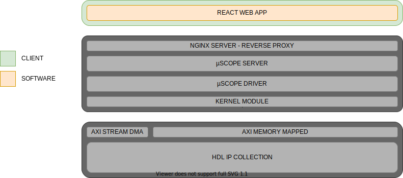

========================
HMI Layer
========================

At the top of the whole µScope platform stack sits the client, this components allows interactions with the rest of the stack,
by reading and writing to peripherals registers and displaying the data captured by the embedded oscilloscope section.
To allow the maximum flexibility and ease of use, the concept of :ref:`applications` was introduced, as a collection of user defined,
parameters and macros used to control a specific subset of peripherals. Each application must be associated with a bitstram file in the
`/lib/firmware` that implements the required logic. To ease development of HDL logic and application level code, :ref:`peripherals`
definitions can specify a fixed interface foundation that decouples the two components, granting the maximum freedom possible.

.. _HMI_layer:

.. toctree::
    :maxdepth: 2
    :caption: User Documentation

    Applications
    Peripherals
    scripting
    Programs
    Bitstreams

.. toctree::
    :maxdepth: 2
    :caption: Internal architecture

    react_components
    redux_store

