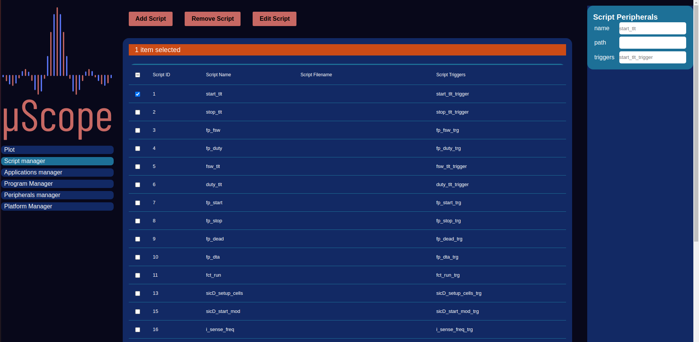

========================
Scripting
========================

    Applications Manager

Scripting stands at the heart of the whole HMI system, acting as a translation  layer between user friendly commands and parameters
and the underlying machine interface. The script execution flow can triggered automatically by a parameter entry or manually through a user event.
Once completed, the requested actions will be either performed at an HMI level or forwarded to the management layer, depending on their type.
For convenience an Integrated text editor allows creation and update of scripts directly in the browser without requiring any other support from the 
host machine. Operatively the Scripting system adopts the Javascript language, adopting the infrastructure and optimizations already present in modern browsers,
allowing execution at near native speed.

.. code-block:: javascript

  function function_name(parameter, context){

    let registers = {};
    let workspace = {};
    /////////////////////////////
    //     USER CODE HERE      //
    /////////////////////////////
    let existing_workspace_variable = cotnext.workspace.['existing_workspace_variable']
    
    workspace['new_workspace_variable_name'] = 42;
    register['peripheral_id.register_id'] = 10;

  
    return {workspace:workspace, registers:registers};
  }

Each script is constituted by a single javascript function that gets called when needed. two inputs are passed to the function, the first is a numeric field that 
contains the value of the parameter that automatically triggered the script (it is undefined for manually triggered ones) and a context object, containig values for
other parameters and the workspace. This last elements is itself an object that is common among all user scripts and can be used to share data and variables
between them. The function shall return an object containing two further objects, one for registers, and one for workspace values, as shown in the example.

The script management view allows creation update and deletion of scripts and related metadata. Each script, apart from the content is identified through the following
information:

- **ID**: Numeric integer value automatically maanged by the system that uniquely identifies each script
- **name**: User friendly identifier string
- **path**: Discontinued value, will be removed in a future version, do not user
- **trigger**: string used by the system as a trigger to match up parameters, user events and scripts
