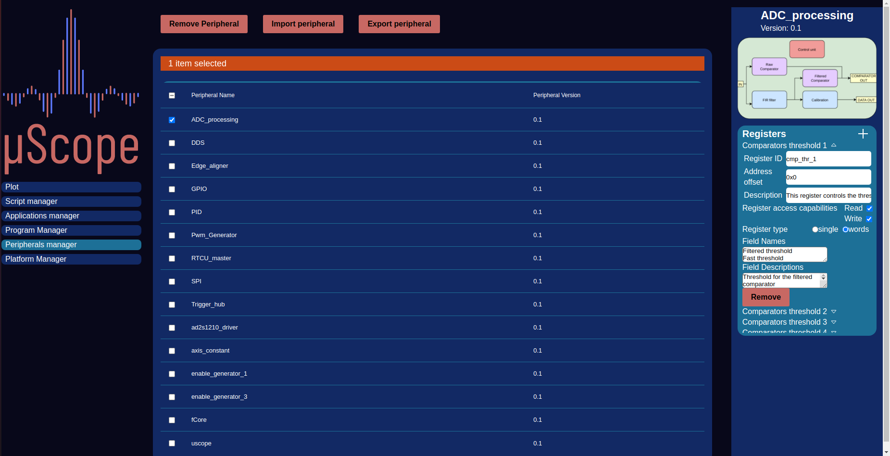

.. _peripherals:

================
Peripherals
================

    Peripheral Manager

The decoupling of Logic HDL and upstream software development requires the definition of a set of a fixed interface to build upon. The Peripheral
fill exactly this role. Their main function is to define the register maps for the logic IP to which it refers, defining names, types and offsets of
all the registers reachable for the bus. As for the Applications, Manager and creator views are provvided to allow easy peripheral definitions.

An Peripheral diagram is also required, this image is usefull to give an idea at a glance of how the internal structure of the IP is constructed.

.. figure:: ../assets/periph_creator.png
    :scale: 25 %

    Peripheral Creator