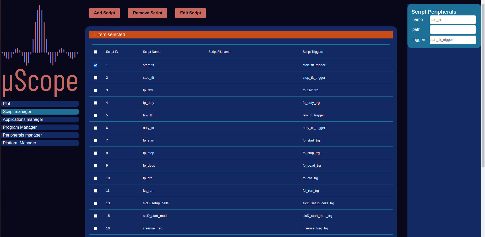

========================
Scripting
========================

    Script Manager

The heart of the Client HMI operations are the scripting capabilities, that allow the user to customize the UI behaviour and tailor it to each
peculiar application. Through a trigger string the script can be associated to either a parameter or a macro. They must be implemented as valid
javascript files containing one or more function. Once triggered the browser will start execution at the function whose name is the same as the
trigger string.

Two arguments will be passed to the function the first is the evantual parameter (used only when the script is triggered by an application parameter)
the second one is a context dictionary containing the old values of the parameters, registers and workspace. Once the execution
has ended the function can return registers to write and variables to save to the workspace. The Script are stored on the local browser, and can be added
and removed through the Script manager
