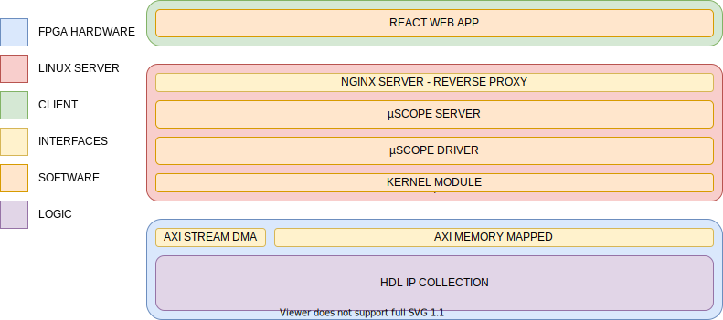

.. µScope documentation master file, created by
   sphinx-quickstart on Thu Dec 26 16:17:19 2019.
   You can adapt this file completely to your liking, but it should at least
   contain the root `toctree` directive.

Welcome to µScope's documentation!
==================================

.. toctree::
    :maxdepth: 3
    :caption: Contents:
    :hidden:

    logic/index
    management/index
    HMI/index

=============
Introduction
=============

µScope is a full stack control solution for power electronics research
and development.
The aim of the project is to allow standalone research in the field of control
theory for both machine drive and grid connected applications.
The tools is also useful as an HMI solution for power electronics research,
in the hardware debug, test and validation phases.

The highly modular architecture allows the tool to be easily retargettable;
despite the high level of vertical integration, each layer in the stack is
fully independent that can be usefully deployed independently from the others.

From a high level perspective the system consists of three main layers: the
lowestone, implemented in the programmable logic part of the Xilinx Zynq SoC,
is responsible for the real time portion of the control system, allowing
to achieve low latencies and very high maximum operating frequencies.
The next layer runs on the Zynq's processing system as a suite of
linux software components, that interfacing with the low level logic layer
runs the server backend of the HMI.
Last but not least the user facing part of the HMI is run directly in the
client browser as a single page web application.

==============================
In depth layers documentation
==============================

* :ref:`Control_layer`
* :ref:`management_layer`
* :ref:`HMI_layer`
