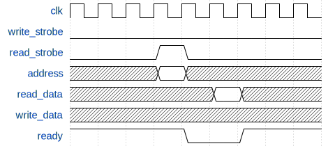
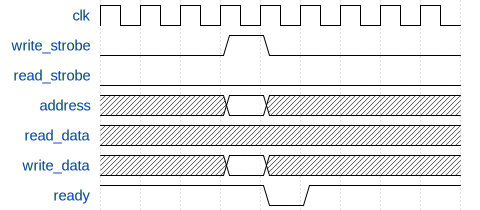

******************************
Interfaces 
******************************

The backbone of any complex system on chip design is undoubtedly the interconnect system that stiches together
all the IP modules allowing various modules and subsystems to communicate together in a reliable and orederly
fashon. It is thus not surprising that several families of interconnection technologies have been introduced
over time by many vendors. As it is expected each solution is tailored to different kind of applications, depending
on each one's need.

To keep the implementation of the control layer modules clear and concise, wide use is make of System Verilog interfaces to
avoid the need of specifying the connection signals of the interconnection BUS every time.

========
AXI
========

One of the industry wide standard interconnect families is ARM's AMBA, used in all designs including ARM processing
cores and IP blocks. The most popular specification from this family is the AXI (Advanced eXtensible Interface), which
is also used on the Zynq System on Chip as the only communication method betweeen programmable logic and processing system.
The main application this interconnect technology has been designed is, in multicore systems, the connection of several
processor cores among themselves and with other high bandwidth peripherals, like graphics processors and high speed communication
interfaces. It is apparent that several features of this interconnection system are specifically designed to allow
efficient and substained transfer of large blocks of data. This specific focus introduces a large ammount of complexity,
requiring separate adress, data and response channels, a large number of support signals. It is thus apparent that for the
applications that this system is designed to cater to, where data transfers are small and sporadic, all these features
add a large amount of unecessary complexity, and their use should be avoided whenever possible.

    **PARAMETERS**

        - **ID_WIDTH**: Width of the id signals
        - **USER_WIDTH**: Width of the user signals
        - **DATA_WIDTH**: Width of the data signals
        - **ADDR_WIDTH** Width of the address signals

    **SIGNALS**

        - **AWID**:  Write Address channel transaction identification tag
        - **AWADDR**: Write Address channel address of the first transfer in a transaction
        - **AWLEN**:  Write Address channel number of transfers in a transaction 
        - **AWSIZE**: Write Address channel number of bytes in each transaction
        - **AWBURST**: Write Address channel type of burst for this transaction
        - **AWLOCK**: Write Address channel transaction atomicity indicator
        - **AWCACHE**: Write Address channel transaction cache properties
        - **AWPROT**: Write Address channel transaction privilege and security level
        - **AWQOS**: Write Address channel quality of service identifier
        - **AWREGION**: Write Address channel region indicator
        - **AWUSER**: Write Address channel user defined extension
        - **AWVALID**: Write Address channel VALID signal
        - **AWREADY**: Write Address channel READY signal
        - **WDATA**: Write data channel data
        - **WSTRB**: Write data channel strobes, byte validity indicator
        - **WLAST**: Write data channel last transfer in transaction signal
        - **WUSER**: Write data channel user defined extension
        - **WVALID**: Write data channel VALID signal
        - **WREADY**: Write data channel READY signal
        - **BID**: Write response channel transaction identification tag
        - **BRESP**: Write response channel response, identifies the write transfer status
        - **BUSER**: Write response channel user defined extension
        - **BVALID**: Write response channel VALID signal
        - **BREADY**: Write response channel READY signal
        - **ARID**: Read Address channel transaction identification tag
        - **ARADDR**: Read Address channel address of the first transfer in a transaction
        - **ARLEN**: Read Address channel number of transfers in a transaction 
        - **ARSIZE**: Read Address channel number of bytes in each transaction
        - **ARBURST**: Read Address channel type of burst for this transaction
        - **ARLOCK**: Read Address channel transaction atomicity indicator
        - **ARCACHE**: Read Address channel transaction cache properties
        - **ARPROT**: Read Address channel transaction privilege and security level
        - **ARQOS**: Read Address channel quality of service identifier
        - **ARREGION**: Read Address channel region indicator
        - **ARUSER**: Read Address channel user defined extension
        - **ARVALID**: Read Address channel VALID signal
        - **ARREADY**: Read Address channel READY signal
        - **RID**: Read Data channel transaction identification tag
        - **RDATA**: Read Data channel data
        - **RRESP**: Read Data channel response, identifies the write transfer status
        - **RLAST**: Read Data channel last transfer in transaction signal
        - **RUSER**: Read Data channel user defined extension
        - **RVALID**: Read Data channel VALID signal
        - **RREADY**: Read Data channel READY signal

    **MODPORTS**

        - **master**: Master side connection
        - **slave**: Slave side connection

======================
AXI lite
======================

AXI lite is a subset of the full AXI interconnect, it is useful when a memory mapped register interface is needed without the complexity
of the complete protocol, its limitations include:

- Full bus width transfer only
- 1 beat per transaction 

This protocol should be used whenever possible in place of the full variant since it has a smaller logic footprint.

**SIGNALS**

- **AWADDR**: Write Address channel address of the first transfer in a transaction
- **AWVALID**: Write Address channel VALID signal
- **AWREADY**: Write Address channel READY signal
- **WDATA**: Write data channel data
- **WVALID**: Write data channel VALID signal
- **WREADY**: Write data channel READY signal
- **BRESP**: Write response channel response, identifies the write transfer status
- **BVALID**: Write response channel VALID signal
- **ARADDR**: Read Address channel address of the first transfer in a transaction
- **ARVALID**: Read Address channel VALID signal
- **ARREADY**: Read Address channel READY signal
- **RID**: Read Data channel transaction identification tag
- **RDATA**: Read Data channel data
- **RRESP**: Read Data channel response, identifies the write transfer status
- **RVALID**: Read Data channel VALID signal
- **RREADY**: Read Data channel READY signal

**MODPORTS**

- **master**: Master side connection
- **slave**: Slave side connection

========
APB
========

A second type of interconnect, from the same family, used to connect lower bandwidth peripherals is the
APB (Advanced Peripheral Bus). Its design is much simpler, with a bus topology, and a much smaller feature set with a much lower
complexity in the connected modules, and a smaller footprint overall. Another advantage of this bus is the availability
of conversion IP compatible with the previously mentioned AXI bus, avoiding the need to interface directly with it.

**SIGNALS**

- **PADDR**:  APB transfer address
- **PPROT**: APB protection signal, indicating whether the transaction is secure or not
- **PSEL**: APB select signal, indicates whether the slave is selected, and a transaction is needed
- **PENABLE**: APB enable signal, indicates the second and following cycles of a transaction
- **PWRITE**: APB direction signal, LOW for a read and HIGH for a write transaction
- **PWDATA**: APB write data bus, driven by the master
- **PSTRB**: APB byte strobe signals, indicates which bytes should be transferred
- **PREADY**: APB ready signal, driven low by a slave to extend a transaction
- **PRDATA**: APB read data bus, driven by the slave
- **PSLVERR**: APB Slave error, indicates a failure in the transaction

**MODPORTS**

- **master**: Master side connection
- **slave**: Slave side connection

============
AXI stream
============

AXI stream is a protocol from the AMBA family targeted to streaming data transfer applications. It sports a unidirectional data flow with
limited control flow and side-channel information.

    **PARAMETERS**

        - **USER_WIDTH**: Width of the user signals
        - **DATA_WIDTH**: Width of the data signals
        - **DEST_WIDTH** Width of the destination signals

    **SIGNALS**

        - **data**: stream data bus
        - **user**: stream user defined extension 
        - **dest**: stream destination signal
        - **valid**: stream valid signal
        - **ready**: stream ready signal
        - **tlast**: stream last signal, indicates the boundary of a packer
      
    **MODPORTS**

        - **master**: Master side connection
        - **slave**: Slave side connection

=============
Simplebus
=============

The large majority of the implemented components use this custom interconnect interface, It has an equivalent feature set with
respect to APB, and it is heavily influenced by the altera Avalon bus (of which is a loose subset), a bidirectional bridge towards
APB is available allowing it to be connected with the rest of the system. To complete a read or write transaction the master sets up
the required signals and then pulses the appropriate strobe signal high for a single clock cycle, if the slave is not ready
for another transaction it can pull the ready signal low and keep it so until it is.

**READ CYCLE**

   Read cycle timing diagram

**WRITE CYCLE**

   Write cycle timing diagram

    **SIGNALS**

        - **sb_address**: Address signal
        - **sb_read_strobe**: read strobe signal, initiates a read transaction when high
        - **sb_read_data**: read data bus
        - **sb_write_data**: write data bus
        - **sb_write_strobe**: write strobe signal, initiates a write transaction when high
        - **sb_ready**: slave ready signal, set low when a slave is busy
        
    **MODPORTS**

      - **master**: Master side connection
      - **slave**: Slave side connection

