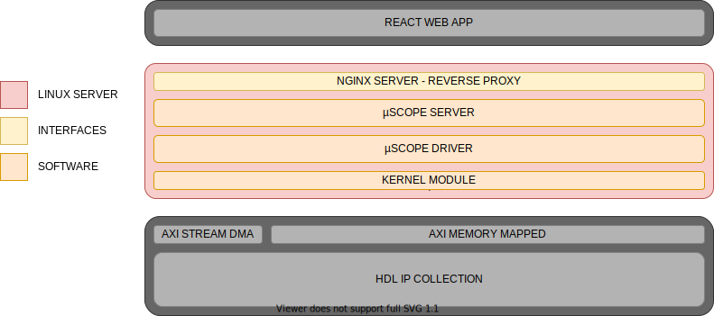

=======================
Management Layer
=======================

The µScope platform server, referred as server from now on, is the component
of the stack that is responsible for all the high level interactions between
the µCube control platform and the outside world, and in particular it is the
component in charge of the human machine interface (HMI). For easier 
deployability the whole server infrastructure is implemented in the processor
system od the Zynq SoC and it interfaces the outside world through standard 
Ethernet connectivity.

.. _management_layer:

.. toctree::
    :maxdepth: 2
    :caption: Management layer

    platform_overview
    layer_components
    uscope_driver
    uscope_server

